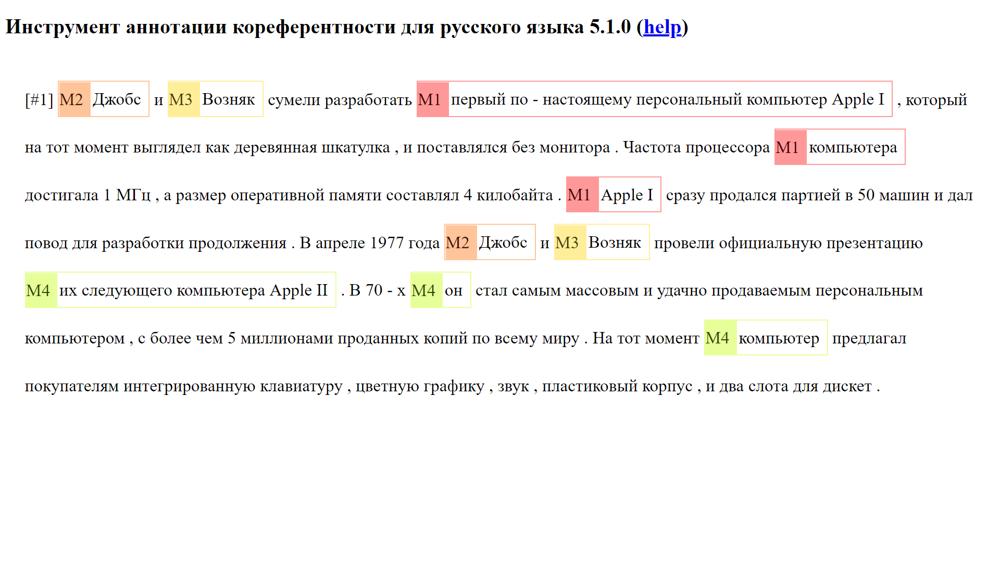

# До безобразия простой инференс разрешения кореферентности для русского языка

## 1. Установите зависимости

Создайте виртуальнукю среду python 3.7, активируйте ее и установите зависимости (`pip install -r requirements.txt`). 
Модель обучена и инференсится при помощи пакета `allennlp==2.2.0`, поэтому проверьте его нормальное функицонирование: `allennlp evaluate --help`. 

## 2. Замените датаридер

Чтобы модель читала вводимые данные правильно, замените файл в dist-packages виртуальной среды с allennlp_models/common/ontonotes.py на ontonotes.py, который лежит в корне этого проекта.

## 3. Скачайте и запустите модель

Скачайте веса модели отсюда: https://storage.googleapis.com/coref-qa-rus-1/model2.tar.gz
И запустите инференс командой: `python autoannotations.py --model [ПУТЬ К МОДЕЛИ]`. 
Например: `python autoannotations.py --model model2.tar.gz` 
Команда предложит ввести текст и выделит в нем кореферентные цепочки, например:  
`Введите текст: Ввозить в Россию гаджеты станет проще, заявил премьер Михаил Мишустин на совещании со своими заместителями. По его словам, это решение обеспечит потребности внутреннего рынка, а также позволит избежать сбоев и остановок производств.` 
Вывод модели: 
`Ввозить в Россию гаджеты станет проще , заявил {M1: премьер Михаил Мишустин } на совещании со {M1: своими } заместителями . По {M1: его } словам , это решение обеспечит потребности внутреннего рынка , а также позволит избежать сбоев и остановок производств .`  
<b>Комментарии:</b> При первом запуске библиотека huggingface скачает и распакует RuBERT Deeppavlov в кэш. Это может занять некоторое время, но привычный прогресс-бар скачивания не отобразится. Обратите внимание, что скрипт выше тестировался на Windows, на Linux что-то может пойти не так. Чем длиннее документ, тем больше размерность тензора, которую модель попытается посчитать, поэтому лучше не загружать длинные документы, если объем ОЗУ на устройсте меньше 10 ГБ.

## 4. Визуализируйте результат

Цепочки можно визулизировать и редактировать, открыв index.html в браузере и вставив полученный выше текст с разметкой в текстовое поле. Получится вот так:

## Благодарности

Красивый редактор из последнего пункта - от Bruno Oberle (https://github.com/boberle/sacr), слегка измененный и переведенный на русский. 

## TODO:

Планирую добавить поддержку вложенных упоминаний в разметке командной строки.

